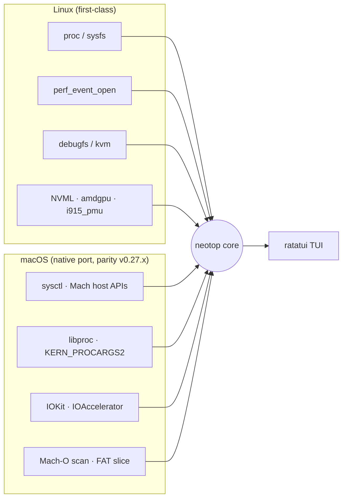
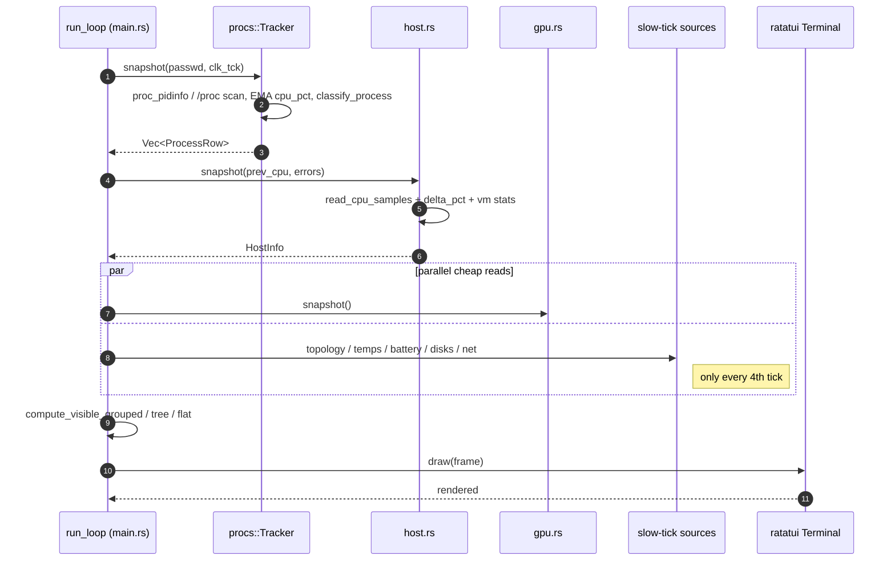
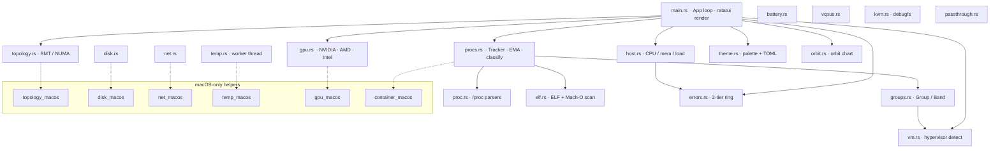
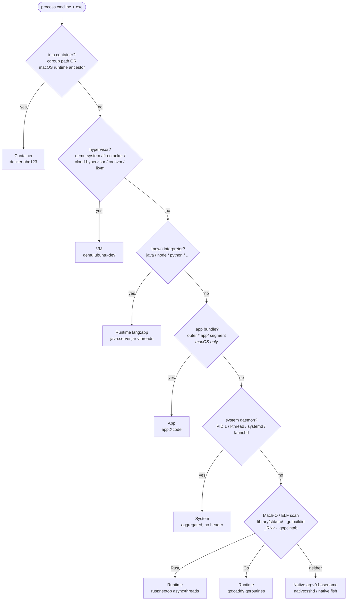
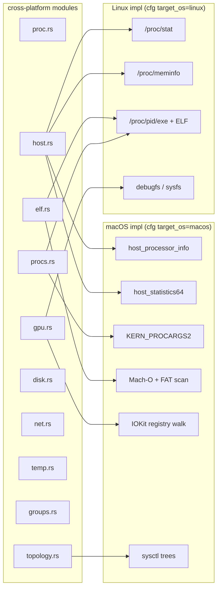

# neotop

[](https://crates.io/crates/neotop)
[](https://crates.io/crates/neotop)
[](LICENSE)
[](https://github.com/nt2311-vn/neotop/actions/workflows/ci.yml)
[](https://github.com/nt2311-vn/neotop/actions/workflows/codeql.yml)


**A terminal system monitor that shows what generic tools hide.**
Per-core CPU spectrum with SMT/NUMA grouping, multi-vendor GPU dashboards,
KVM hypervisor insight, **universal process grouping** (every row lives in a
named aggregate — container, VM, runtime, `.app` bundle, or `native:<bin>`),
and a fully themeable TUI. Single binary, no daemons, no config required.

Linux-first, with a fully native macOS port (sysctl / IOKit / Mach / Mach-O)
that reached functional parity in `v0.27.x`.

```text
 CPU  8.3%  MEM 9.1G/15.7G (58%)  load 0.31 0.28 0.22  kernel 6.9.3  Ryzen 7 7840HS
 ── NUMA 0 ─────────────────────────────────────────────────────────────────────────
 c0a ▁▂▃▄▅▄▃▂▁▁  8% ▕██░░▏  c0b ▁▁▁▁▂▁▁▁  2% ▕░░░░▏  c1a ▇▆▅▄▃▂▁▁  3% ▕█░░░▏
 c1b ▁▁▁▁▁▁▁▁    1% ▕░░░░▏  c2a ▂▃▄▅▆▅▄▃ 18% ▕███░▏  c2b ▁▁▂▁▁▁▁▁  4% ▕█░░░▏
 ┌─ CPU  8% ─┬─ MEM 58% ─┬─ NET↓ 2.1 MB/s ─┬─ NET↑ 84 KB/s ─┬─ GPU 41% ─┬─VRAM 31%─┐
 │ ▁▂▃▅▆▅▄▃▂ │ ██████▌░░ │ ▁▂▃▁▁▅▆▄▂▁▁▁▁  │ ▁▁▁▁▁▂▁▁▁▁▁▁▁  │ ▂▄▆▅▃▄▅▄▃ │ ▂▂▂▂▂▂▂▂▂ │
 └───────────┴───────────┴─────────────────┴────────────────┴───────────┴──────────┘
 gpu  AMD Radeon 780M ⣾⣷⣶⣤ 41%  ▕█████░░░▏  vram 1.9G/8.5G (22.4%)  ▕██░░░░░░▏
 ┌── procs ──────────────────────────┐ ┌── process orbit · busy = bigger radius ─┐
 │ ▼ docker:caddy        (2) 72.4%   │ │            ·          ●                │
 │ ▼ qemu:ubuntu-dev     (1) 18.9%   │ │      ·          12p           •        │
 │ ▼ rust:neotop [async] (1)  0.3%   │ │            •          ·                │
 │ ▼ app:Google Chrome  (34) 12.8%   │ │ 12345 firefox       45.2% S            │
 │ ▼ native:fish         (2)  0.0%   │ │ 67890 chromium      22.1% R            │
 └───────────────────────────────────┘ └────────────────────────────────────────┘
```

---

## Status

Everything neotop pulls live from the host, per platform.



| Area | Linux | macOS | Notes |
|------|-------|-------|-------|
| Per-core CPU % + history | ✅ `/proc/stat` | ✅ `host_processor_info(PROCESSOR_CPU_LOAD_INFO)` | SMT / NUMA grouped |
| CPU topology | ✅ `/sys/devices/system/cpu/*/topology` | ✅ `sysctl hw.{logical,physical}cpu` | UMA on Apple Silicon |
| Memory (used / buffers / cached / free) | ✅ `/proc/meminfo` | ✅ `host_statistics64(HOST_VM_INFO64)` | [See mapping notes](docs/platforms-macos.md) |
| Swap | ✅ `/proc/meminfo` | ✅ `sysctlbyname("vm.swapusage")` | |
| Load average | ✅ `/proc/loadavg` | ✅ `sysctl vm.loadavg` | |
| Process list + cmdline | ✅ `/proc/<pid>/{stat,cmdline,status,limits}` | ✅ `proc_pidinfo` + `KERN_PROCARGS2` | Full argv on macOS (v0.27.1+) |
| Per-process disk I/O | ✅ `/proc/<pid>/io` | ⚠ unavailable | needs taskinfo or private SPI |
| Per-disk I/O rates | ✅ `/proc/diskstats` | ✅ IOKit `IOBlockStorageDriver` | |
| Per-interface net rates | ✅ `/proc/net/dev` | ✅ `sysctl NET_RT_IFLIST2` | |
| Temperatures | ✅ `/sys/class/hwmon` | ⚠ SMC / IOReport stub | full SMC protocol pending |
| Battery | ✅ `/sys/class/power_supply` | ⚠ not wired | IOPowerSources pending |
| GPU — NVIDIA | ✅ NVML (dlopen) | ✅ NVML (dlopen, eGPU) | |
| GPU — AMD | ✅ `amdgpu` sysfs | ✅ IOKit (`AMDRadeon*`) | |
| GPU — Intel | ✅ RC6 + `i915_pmu` per-engine | ✅ IOKit (`IntelAccelerator*`) | |
| GPU — Apple Silicon | — | ⚠ IOKit stats often empty | needs private IOReport SPI for reliable busy% |
| KVM exits / vCPU pinning | ✅ `/proc/<vm>/task` + debugfs | — | Linux-only (KVM is a Linux kernel subsystem) |
| VFIO / vhost / tap passthrough | ✅ sysfs | — | Linux-only by nature |
| Group view — **every row** | ✅ | ✅ | see [Grouping pipeline](#process-grouping-pipeline) below |
| Group — Container (real per-container stats) | ✅ cgroup | ⚠ host-only detection | containers live inside LinuxKit VM |
| Group — `.app` bundle | — | ✅ outermost `.app/` in exe path | Electron / Chromium / Xcode swarms cluster |
| Group — Language runtime | ✅ argv + ELF scan | ✅ argv + Mach-O scan | Java/Node/Python/Rust/Go/etc. |
| Group — VM / hypervisor | ✅ argv parse | ✅ argv parse | QEMU / UTM / Lima / Colima / Firecracker / Cloud Hypervisor / crosvm / lkvm |

Legend: ✅ works · ⚠ partial / stubbed · — not applicable on this OS.

---

## Install

From [crates.io](https://crates.io/crates/neotop) (recommended):

```sh
cargo install neotop --locked
```

From source:

```sh
cargo install --git https://github.com/nt2311-vn/neotop --locked
cargo install --path .
```

Binary is single-file, ~1.5 MB, no runtime deps.

**Feature flags** (all default-on):

| Flag | What it adds | Disable with |
|------|-------------|--------------|
| `nvml` | NVIDIA GPU metrics via dynamic `libnvidia-ml.{so,dylib}` | `--no-default-features` |
| `i915-pmu` | Intel GPU per-engine breakdown via `perf_event_open` | `--no-default-features` |

```sh
cargo install neotop --locked --no-default-features   # smallest build
```

---

## Architecture

### Data flow — one tick



- **1 Hz default tick.** `+`/`-` retune 50 ms … 5 s.
- **EMA-smoothed CPU %.** α = 0.5 — spikes register on the first tick but don't thrash sort order.
- **PID-locked cursor.** CPU sort reshuffles every tick; the cursor follows the same PID.
- **Slow tick for expensive sources.** Temps, batteries, disks, GPUs, topology every 4 ticks.
- **Off-thread temp worker.** `acpitz` can block seconds; UI never stalls.

### Module topology



Solid edges are always-on. Dashed edges are `#[cfg(target_os = "macos")]` platform delegates.

### Process grouping pipeline

The `g` toggle runs every process through this classifier. **Every** row ends up
in a named aggregate — there is no headerless "misc" tail. Only the System band
stays banner-less (launchd / kernel daemons would drown real workloads).



Priority order top-down; the first hit wins. Each band has its own colour in
the theme (`group_container`, `group_vm`, `group_runtime`, `group_app`,
`group_system`, `group_native`).

### Platform-specific code selection



### Repository layout

```text
src/
  main.rs            App struct, run loop, all ratatui UI rendering
  proc.rs            /proc/<pid>/{stat,status,limits,cgroup} parsers
  procs.rs           Tracker, EMA cpu_pct, disk I/O, Mach-O/ELF upgrade
  host.rs            CPU samples, mem/swap, loadavg, kernel + model
  net.rs / net_macos.rs             per-iface rate tracker
  disk.rs / disk_macos.rs           per-device rate tracker
  temp.rs / temp_macos.rs           off-thread sensor scanner
  battery.rs                        AC + battery gauge
  gpu.rs / gpu_macos.rs             NVIDIA / AMD / Intel discovery + metrics
  topology.rs / topology_macos.rs   SMT + NUMA groups
  theme.rs                          palette + TOML overrides + presets
  groups.rs                         Group enum + band classifier
  container_macos.rs                macOS-only container heuristic
  vm.rs / vcpus.rs / kvm.rs         hypervisor detection + vCPU map + exits
  passthrough.rs                    VFIO + vhost + tap inventory
  elf.rs                            ELF64 + Mach-O (FAT) language scan
  errors.rs                         bounded 2-tier event ring
  orbit.rs                          process orbit chart
```

MSRV 1.88. `unsafe` is minimised and each block carries a `SAFETY:` comment —
used only for `perf_event_open`, macOS `sysctl` / `libproc` / Mach calls, and
IOKit FFI.

---

## Controls

| Key             | Action                                                  |
| --------------- | ------------------------------------------------------- |
| `q` / `Ctrl-C`  | quit                                                    |
| `?`             | toggle the keybindings overlay                          |
| `j` / `k`       | move selection (also `↓` / `↑`)                         |
| `PgDn` / `PgUp` | jump 10 rows                                            |
| `r`             | force an immediate refresh                              |
| `+` / `-`       | speed up / slow down the refresh tick (50 ms … 5 s)     |
| `space`         | pause / resume the live tick                            |
| `s`             | cycle sort: CPU → MEM → PID → CMD                       |
| `t`             | toggle tree view (parent → children)                    |
| `g`             | toggle **group view** (every row in a named aggregate)  |
| `H`             | toggle per-core CPU **spectrum** view                   |
| `T`             | cycle theme: Dark → Light → Monokai → Tty → Dark        |
| `/`             | enter filter mode (`Esc` clears, `Enter` confirms)      |
| `K`             | send `SIGTERM` to selected pid (with confirm)           |
| `Ctrl-K`        | send `SIGKILL` to selected pid (with confirm)           |

---

## Configuration

Theme and colour overrides live in `~/.config/neotop/config.toml`.
All fields optional; missing ones use the preset default.

```toml
theme = "dark"   # dark | light | monokai | tty

[colors]
cpu_high      = "#f38ba8"     # hex RGB
spark_mem     = "203,166,247" # decimal RGB
label         = "i244"        # 256-colour index
border        = "DarkGray"    # ratatui named colour
group_app     = "#f9e2af"     # new in v0.28
```

Override the config path at the command line:

```sh
neotop --config ~/dotfiles/neotop.toml
```

Press `T` to cycle the four built-in presets (Catppuccin Mocha, Light, Monokai, Tty)
without restarting.

---

## Develop

```sh
just                  # list every recipe
just check            # fmt --check + clippy -D warnings + tests
just release          # cargo build --release
just run              # cargo run --release
```

The CI gate (mirrored by `just check`) is:

1. `cargo fmt --all --check`
2. `cargo clippy --all-targets --locked -- -D warnings`  *(Linux native)*
3. `cargo clippy --target aarch64-apple-darwin --locked -- -D warnings`  *(macOS cross-compile)*
4. `cargo test --all-targets --locked`
5. `cargo check --target aarch64-apple-darwin --locked`

Rule: if all five pass locally, the GitHub CI will pass. Don't skip the
cross-compile step — it's the #1 source of CI-only failures.

---

## Documentation

Deeper design docs live in [`docs/`](docs/) as an Obsidian vault — open the
repo folder in Obsidian to get backlinks, graph view, and `[[wikilink]]`
navigation. Entry point: [`docs/index.md`](docs/index.md).

Highlights:

- [`docs/architecture.md`](docs/architecture.md) — tick loop, slow-tick cadence, error ring
- [`docs/grouping.md`](docs/grouping.md) — full classifier pipeline incl. macOS `.app` path
- [`docs/platforms-linux.md`](docs/platforms-linux.md) — every `/proc` and `/sys` path we read
- [`docs/platforms-macos.md`](docs/platforms-macos.md) — sysctl / IOKit / Mach map
- [`docs/status.md`](docs/status.md) — parity matrix + known-broken items
- [`docs/glossary.md`](docs/glossary.md) — band, runtime, SMT, NUMA, EMA, tick

Other top-level references:

- [`CHANGELOG.md`](CHANGELOG.md) — full release history with rationale
- [`AGENTS.md`](AGENTS.md) — contributor & AI-agent rules (CI gates, clippy pitfalls, cfg discipline)
- [`SECURITY.md`](.github/SECURITY.md) — disclosure policy

---

## Contributing

PRs welcome. `main` is protected: every change goes through a feature branch
+ PR + CI. See [`.github/pull_request_template.md`](.github/pull_request_template.md).
Security issues go through a private advisory — [`SECURITY.md`](.github/SECURITY.md),
not a public issue.

## License

Apache-2.0. See [`LICENSE`](LICENSE).

---

## Recently shipped

Full history: [`CHANGELOG.md`](CHANGELOG.md).

- [x] **Universal grouping** (`v0.28`) — `Native(basename)` carries a name,
      macOS `.app` bundles get their own `App` band, every visible row
      lives under a named header.
- [x] **macOS memory bar + Rust/Go group detection** (`v0.27.2`)
- [x] **macOS real CPU / mem sampling, full argv, phantom GPU gone** (`v0.27.1`)
- [x] **macOS feature parity** — topology, containers, disk, net, temp (`v0.27.0`)
- [x] macOS TUI bring-up + GPU via IOKit (`v0.26.0`)
- [x] Process orbit chart (`v0.25.0`)
- [x] Intel GPU per-engine `rcs`/`bcs`/`vcs`/`vecs` via `i915_pmu` (`v0.24.0`)
- [x] SMT + NUMA grouping in the per-core spectrum (`v0.24.0`)
- [x] Catppuccin Mocha default + TOML overrides (`v0.23.0`)
- [x] Intel iGPU RC6 residency busy% — no root required (`v0.19.0`)
- [x] KVM exits + per-VM CPU sparkline (`v0.16.0` / `v0.18.0`)
- [x] VFIO + vhost + tap passthrough discovery (`v0.18.0`)
- [x] Go / Rust runtime detection via ELF scan (`v0.16.0`)
- [x] Per-app sub-buckets inside runtime groups (`v0.17.0`)

## Roadmap

Open items:

- [ ] Real Docker Desktop container telemetry on macOS via the local UNIX socket (`/containers/json` + `/containers/{id}/stats`). Current detector only sees host-side Docker Desktop components.
- [ ] Apple Silicon GPU busy% via the private IOReport SPI (macOS `IOAccelerator` exposes `Device Utilization %` unreliably on M-series).
- [ ] macOS temperature sensors — full SMC protocol on Intel, IOReport channel subscription on Apple Silicon.
- [ ] macOS per-process disk I/O (`taskinfo` or private SPI).
- [ ] Windows: ETW + PDH counters (separate epic).
- [ ] Intel GPU **true per-engine** power draw (blocked upstream — i915 PMU exposes busy only, not energy; package-level already shipped via RAPL).
