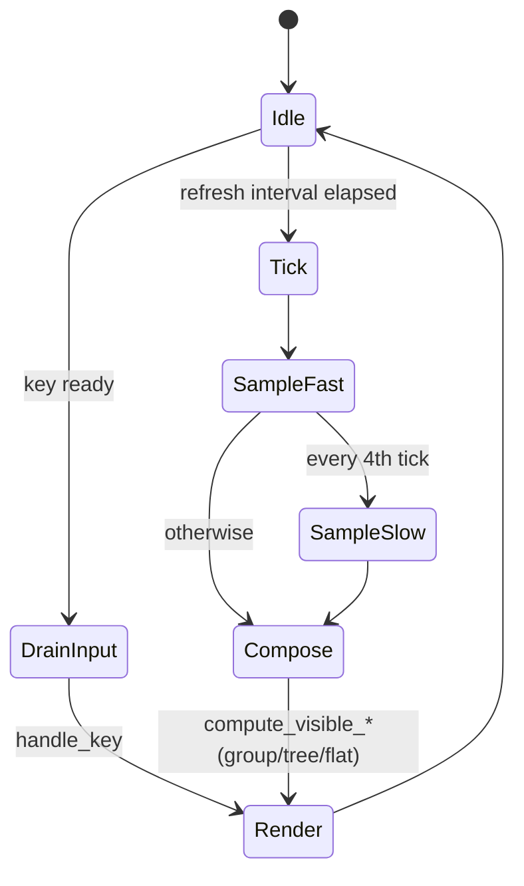
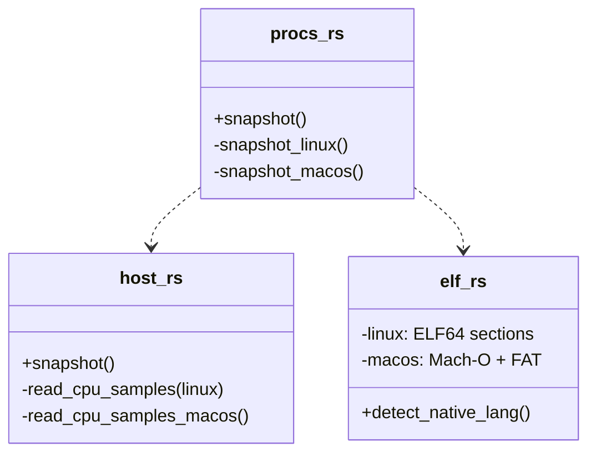

# Architecture

How one tick turns into one frame. See also [[modules]] for the one-line
summary of every file, and [[grouping]] for the process classifier.

## The loop

Default refresh interval is 1 s. `+` / `-` retune it between 50 ms and 5 s.
`space` pauses. `r` forces an immediate tick regardless of the timer.

## Per-tick work

Fast path (every tick):

1. `procs::Tracker::snapshot` — walks `/proc` (or `proc_listallpids` on
   macOS), reads per-process stats, updates the EMA cpu% using the
   previous tick as baseline, runs [[grouping|classify_process]] on new
   PIDs only.
2. `host::snapshot` — per-core + aggregate CPU ticks delta, memory,
   load average, kernel, CPU model.
3. `gpu::Snapshot::gather` — NVML / sysfs / IOKit enumeration; per-card
   busy %, VRAM, power, Intel per-engine, history ring.
4. `errors::ErrorRing` — drain pending non-fatal events.

Slow path (every 4th tick, so 4 s at default):

- `topology::CpuTopology::read` — SMT sibling and NUMA node map.
- `temp::TempWorker::poll` — drained from the off-thread worker.
- `battery::list` — AC + battery.
- `disk::Tracker::snapshot` — per-device R/W bytes & rates.
- `net::IfaceTracker::snapshot` — per-interface RX/TX bytes & rates.

Why the split? Temperature probes on some `acpitz` hardware block for
seconds. GPU reads via NVML cost ≥ 10 ms. Doing them at 1 Hz would chew
CPU we don't have to spend — the values don't change that fast anyway.

## Thread model

- **Main thread**: UI loop, input, all `/proc` reads, all drawing.
- **Temp worker** ([[modules|temp.rs]]): separate OS thread. Main thread
  posts a request channel message every slow tick; worker replies when
  the scan is done (potentially seconds later). If the reply isn't in,
  the UI keeps rendering the last known values.
- **No async runtime**. neotop is resolutely sync; the only long-latency
  source is temperature and it gets its own thread.

## Error handling

Every non-fatal failure goes through [[modules|errors.rs]]:

- **Warn** (⚠) — the user lost a data source (e.g. `/proc/stat` unreadable).
- **Info** (ℹ) — self-protection (e.g. temp worker skipped a pass because
  the previous one is still in flight).

The ring is bounded (most recent 64). A persistent banner above the
process table renders the last non-stale entry.

## State retained across ticks

- `prev_host_cpu: CpuSamples` — previous aggregate + per-core tick
  counters. Needed to compute a delta for %CPU.
- `procs::Tracker::prev` — per-PID `Sample { jiffies, when, smoothed_cpu,
  read_bytes, write_bytes, smoothed_*_bps }`. Drives the EMA and disk
  throughput.
- `procs::Tracker::cache` — `StaticInfo { uid, user, command, group }`
  keyed by PID. Anything immutable post-`exec` goes here to avoid
  re-reading argv / uid / cgroup on every tick.
- `host_history` — ring buffers for CPU / MEM / NET / GPU / VRAM
  sparklines (60 samples = 1 min at 1 Hz).
- `per_core_history` — ring buffers behind the per-core spectrum.
- `container_names` — cached `docker ps` / `podman ps` lookup so the
  container band can show human names, not short IDs.

## Platform delegation

Every module that has platform-specific work uses `#[cfg(target_os =
"…")]` to pick an impl:

The public surface of each module stays identical across platforms; only
the impl changes. See [[platforms-linux]] and [[platforms-macos]] for the
concrete syscalls each branch uses.

## Why 1 Hz

Most TUIs run at 4 Hz (`htop`, `btop`). That gives a sense of motion but
buys almost nothing for readability: between two neighbouring frames the
eye can't pick up the delta. 1 Hz is calmer, the CPU cost is 4× lower,
and the EMA smoothing (α = 0.5) still catches a real spike on the frame
after it happens.

## See also

- [[grouping]] — what the classifier pipeline does on every PID
- [[performance]] — where the tick budget actually goes
- [[status]] — which data sources are live / stubbed per platform
