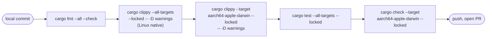

# Contributing

Rules for humans and AI agents. Anything here overrides the global
`~/.claude/CLAUDE.md` / `~/.config/devin/AGENTS.md` defaults for this
project.

## Branch & PR flow

- `main` is protected. No direct commits.
- Work on a feature branch named `fix/<topic>`, `feat/<topic>`,
  `chore/<topic>`, or `docs/<topic>`.
- Open a PR, wait for CI, request review, merge via squash.

## The CI gate (five checks)

Mirrored by `just check`. **If all five pass locally, GitHub CI will
pass.** Don't skip the macOS cross-compile — it's the #1 source of
CI-only failures.



## Common clippy pitfalls

Most frequent repo-specific lints that bite new code:

| Lint | Pattern | Fix |
|------|---------|-----|
| `derivable_impls` | Manual `Default` impl | `#[derive(Default)]` |
| `needless_range_loop` | `for i in 0..len { v[i] }` | `for x in &mut v` or `.enumerate()` |
| `manual_checked_ops` | `if x > 0 { a / x } else { y }` | `a.checked_div(x).unwrap_or(y)` |
| `items_after_test_module` | Code after `#[cfg(test)] mod tests` | Move above test module |
| `cast_precision_loss` / `cast_sign_loss` | `x as f64`, `x as u64` | add targeted `#[allow]` with comment, or use `TryFrom` |
| `unnecessary_lazy_evaluations` | `.unwrap_or_else(\|\| Struct { ... })` | `.unwrap_or(Struct { ... })` for cheap values |

## Platform-specific code rules

Platform guards live on module declarations in `main.rs`:

```rust
#[cfg(target_os = "macos")] mod gpu_macos;
#[cfg(target_os = "linux")] mod kvm;
```

**Never use bare `#[cfg(not(target_os = "linux"))]`** — that silently
swallows macOS. Use `#[cfg(not(any(target_os = "linux", target_os = "macos")))]`
for the "other platforms" fallback.

### FFI discipline

- Every `unsafe` block carries a `SAFETY:` comment.
- macOS uses `libc` for `proc_pidinfo` / `sysctl` / Mach calls and
  `io-kit-sys` + `core-foundation` for IOKit.
- Linux uses `rustix` where possible, `libc` when we need specific
  syscalls.
- **Never use `libc::kinfo_proc`** — it's not available when
  cross-compiling from Linux. Use `proc_pidinfo(PROC_PIDTBSDINFO)`.

## Adding a new data source

Template:

1. Create `src/<name>.rs` with a pure parser + a Linux impl.
2. If the data has a macOS equivalent, create `src/<name>_macos.rs`
   and have `<name>.rs`'s public functions delegate via `#[cfg]`.
3. Mock the parser with a canned fixture in `#[cfg(test)] mod tests`.
4. Add the module to `main.rs` with appropriate `#[cfg]` guards.
5. Wire it into the tick (hot or slow) in `App::tick`.
6. Draw it in `draw_*` — add a semantic colour field if needed.
7. Update [[modules]], [[platforms-linux]] / [[platforms-macos]],
   [[status]], and `CHANGELOG.md`.

## Commit conventions

- Conventional-commit prefixes: `feat:`, `fix:`, `chore:`, `docs:`,
  `refactor:`.
- Scope platform when relevant: `feat(macos):`, `fix(linux):`.
- Subject line ≤ 50 chars.
- Body explains *why*, not *what*.
- **No LLM attribution trailers.** See the hard rule in
  `~/.claude/CLAUDE.md` / `~/.config/devin/AGENTS.md`.

## Tests

- Parsers must have a unit test against a canned fixture string. See
  `host::parse_cpu_samples` or `groups::parse_container_cgroup` for the
  shape.
- Rendering is exercised via `compute_visible_*` tests in `main.rs`.
- Platform-specific live tests are `#[ignore = "requires real <OS>
  hardware"]` and can be opted into with
  `cargo test -- --ignored`.

## See also

- [[release-process]] — version bump / tag / publish
- [[architecture]] — the tick & thread model you'll plug into
- `AGENTS.md` at repo root — canonical CI / clippy / platform rules
