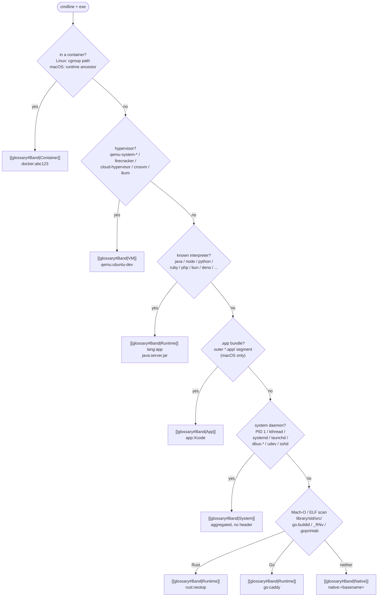
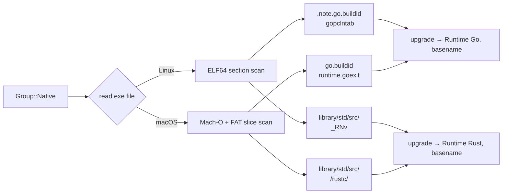

# Process grouping

The `g` toggle aggregates the flat process list into bands. Every
surviving row ends up in a named group; the only silent aggregate is the
System band (launchd / kernel daemons would drown real workloads).

See [[modules|groups.rs]] for the source and [[glossary|band]] for the
terminology.

## Pipeline

First match wins. The order is intentional: container beats hypervisor
beats runtime beats bundle beats system beats catch-all.

## Bands and visuals

| Band | Sort key prefix | Header shown? | Theme field |
|------|-----------------|---------------|-------------|
| Container | `0_` | ✅ | `group_container` |
| VM | `1_` | ✅ | `group_vm` |
| Runtime | `2_` | ✅ | `group_runtime` |
| App *(macOS)* | `3_` | ✅ | `group_app` |
| System | `4_` | ❌ (aggregated silently) | `group_system` |
| Native | `5_` | ✅ | `group_native` |

When the user sorts by CPU or MEM, the busiest group bubbles to the top
regardless of band priority. When sorting by PID or Command, band order
is restored (Container first, Native last).

## Why each band exists

- **Container** — "which of my containers is hot?" Flat lists bury this
  because each container launches 3–15 sibling processes whose names
  repeat across images. Clustering by runtime + short ID turns a wall of
  `nginx` / `postgres` / `redis` into "this Docker container is using
  72 % CPU".
- **VM** — same question for hypervisors. Each QEMU process exposes
  `-name`, `-smp`, `-m` via its cmdline; we parse those into
  `qemu:ubuntu-dev (4 vCPU, 8 GiB)`.
- **Runtime** — every developer laptop has 30 Node processes and 5 Java
  services. Clustering by `lang:app` (`node:server.js`, `java:app.jar`)
  tells you "the JVM eating CPU is `app.jar`, not `gradle`". The `[sig]`
  tag (`[event loop]`, `[vthreads]`, `[goroutines]`) is a concurrency-
  model hint so the thread count reads correctly.
- **App** *(macOS only)* — Electron / Chromium / Xcode spawn 10–30
  helper processes per window. Without this band they'd spread across
  many `native:*` rows. Clustering by the outermost `.app/` in the
  executable path collapses all those helpers under `app:Google Chrome`
  / `app:Visual Studio Code` / `app:Xcode`.
- **System** — PID 1, kernel threads, launchd, systemd, dbus-*. Real
  workloads aren't here and a header sum would always be the largest
  row in the table, drowning useful signal. Members render without a
  banner.
- **Native** *(now per-basename)* — anything that survived the pipeline.
  Previously one giant "native" bucket; now grouped by argv[0]
  basename, so `native:sshd (3)`, `native:fish (2)`, `native:mdworker
  (5)`, etc. Each distinct binary gets its own header.

## Interpreter vs compiled runtimes

Scripted runtimes are detected by `classify_lang` via argv[0] basename
match against a fixed table. Their `app` field is parsed from the rest
of the argv:

| Interpreter | Strategy |
|-------------|----------|
| Java | `-jar foo.jar` → `foo.jar`, else last non-flag (main class) |
| Python | `-m pkg.mod` → `pkg.mod`, `-c` → `(inline)`, else first script |
| Node / Bun / Deno | first non-flag after interpreter |
| Ruby / PHP / Perl / Lua / R / .NET | first non-flag after interpreter |
| Erlang | — (empty, BEAM cmdlines too varied) |

Compiled runtimes (Rust, Go) can't be told apart from any other native
binary by cmdline alone. After `classify_process` returns
`Group::Native(...)`, `procs.rs` makes a second pass:

This runs once per new PID (result cached in `StaticInfo`) so the I/O
cost is bounded.

## See also

- [[modules|groups.rs]] — enum + classifier
- [[modules|elf.rs]] — ELF / Mach-O scanner
- [[architecture]] — where the classifier sits in the tick
- [[platforms-macos]] — how `.app` bundles are extracted from exe path
