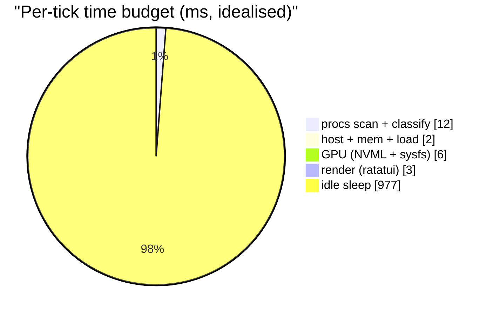

# Performance

Where the tick budget goes and why 1 Hz is the default.

## Tick budget (typical laptop, 1 Hz)

Real numbers vary, but the headline is that ~23 ms is spent sampling
and drawing, and the rest of the second is `poll_key` sleeping. A slow
tick (every 4th) adds ≤ 50 ms for temperatures / batteries / disks /
topology.

## Hot paths

1. **`/proc` walk** — on Linux the process scan opens 5–8 files per PID
   (stat, status, cmdline, cgroup, io, limits). On a machine with 500
   PIDs that's ~2 500 syscalls. `procfs` reads are all kernel-memory
   copies so this stays fast; we don't fork `ps(1)` or similar.
2. **macOS libproc** — `proc_pidinfo` with `PROC_PIDTASKINFO` /
   `PROC_PIDTBSDINFO` is the equivalent. Typical ~5 μs per call.
3. **EMA update** — pure float math, negligible.
4. **[[grouping|classify_process]]** — runs *once per new PID*, result
   cached in `StaticInfo`. The ELF / Mach-O probe only runs on the
   Native-fallback path (not every PID).
5. **NVML** — `nvmlDeviceGetUtilizationRates` is 8–12 ms per device.
   Only runs at the slow tick.
6. **Ratatui render** — O(rows × cols). Dominated by the process table;
   usually ~3 ms at terminal widths ≤ 200 cells.

## Why 1 Hz

- **Lower CPU**: 4× less sampling than `htop` / `btop` default.
- **Readability**: the EMA (α = 0.5) converges in 2–3 ticks; spikes are
  visible on the frame after they occur.
- **Predictable**: the user can read a number before it changes.

`+` / `-` retune between 50 ms (fast, for debugging) and 5 s (very low
overhead, fine for servers).

## Cache discipline

Everything immutable post-`exec` lives in `procs::Tracker::cache`:

- uid / user
- command (full argv)
- group classification
- ELF / Mach-O probe result

That cache grows unboundedly until a PID goes away (at which point the
tracker prunes on the next tick). Worst case ~1 MB for a few thousand
processes.

## Slow-tick cadence

Every 4th tick the main loop also runs:

- `topology::CpuTopology::read` — one sysfs / sysctl pass
- `temp::TempWorker::poll` — drains the off-thread worker queue
- `battery::list` — sysfs walk
- `disk::Tracker::snapshot` — one `/proc/diskstats` or IOKit pass
- `net::IfaceTracker::snapshot` — one `/proc/net/dev` or sysctl pass
- GPU full refresh (NVML / sysfs / IOKit)

Between slow ticks, the values are cached and redrawn as-is. The UI
doesn't know they're stale and the user doesn't notice — these numbers
don't meaningfully change in < 4 s.

## Off-thread temperature scanner

Some `acpitz` sensors block the reader for 5+ seconds while probing.
Doing that on the UI thread would freeze the whole TUI. [[modules|temp.rs]]
runs a dedicated OS thread: the main loop posts requests, the worker
replies when done. If the reply isn't in by the next slow tick, the UI
keeps rendering the last known reading.

## Things we deliberately don't do

- **No async runtime.** Zero tokio / async-std / futures dependencies.
  The only long-latency source is temp and it has its own thread.
- **No `ps(1)` forks.** Forking + parsing ASCII is 100× slower than
  direct `/proc` reads.
- **No `top`-style inverted refresh.** We always draw the same frame
  layout; no per-tick header churn.
- **No config reload on every tick.** Config is read at startup and on
  explicit `T` cycling only.

## See also

- [[architecture]] — tick loop + thread model
- [[modules]] — where each data source lives
