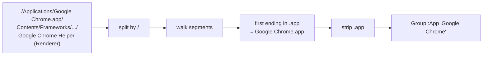

# macOS platform surfaces

The macOS port mirrors the Linux data-source map using native public
APIs only — no private SPIs, no root, no `ps(1)` forks.

## Coverage overview

```mermaid
flowchart LR
  app[neotop] --> sysctl[sysctl / sysctlbyname]
  app --> mach[Mach host APIs]
  app --> libproc[libproc]
  app --> iokit[IOKit registry]
  app --> macho[Mach-O scan]

  sysctl --> kern[hw.* · vm.* · kern.* · net.*]
  mach --> hostinfo[host_processor_info<br/>host_statistics64]
  libproc --> pidinfo[proc_listallpids<br/>proc_pidinfo · proc_pidpath]
  iokit --> reg[IOServiceMatching:<br/>IOAccelerator · IOMedia]
  macho --> exe[/proc-equivalent: exe at path]
```

## Per-process (procs.rs + libproc)

| Call | Source | Purpose |
|------|--------|---------|
| `proc_listallpids` | libproc | enumerate every PID on the system |
| `proc_pidinfo(PROC_PIDTASKINFO)` | libproc | user / system ticks, RSS, thread count |
| `proc_pidinfo(PROC_PIDTBSDINFO)` | libproc | UID, PPID, comm |
| `proc_pidpath` | libproc | absolute executable path |
| `sysctl({CTL_KERN, KERN_PROCARGS2, pid})` | kernel | **full argv** — needed to distinguish `java -jar foo.jar` from bare `java`. Fixed in v0.27.1. |

## Host (host.rs + Mach)

| Call | Purpose |
|------|---------|
| `host_processor_info(mach_host_self(), PROCESSOR_CPU_LOAD_INFO, …)` | per-CPU tick counters (USER / SYSTEM / IDLE / NICE). We delta across ticks exactly like `/proc/stat`. |
| `host_statistics64(mach_host_self(), HOST_VM_INFO64, …)` | `vm_statistics64` — free / inactive / active / wired / speculative / purgeable / external / compressor page counts. |
| `sysctlbyname("vm.swapusage")` | `xsw_usage` — swap total / avail. |
| `sysctlbyname("hw.memsize")` | RAM total. |
| `sysctl({CTL_VM, VM_LOADAVG})` | 1 / 5 / 15-min load. |
| `sysctlbyname("hw.logicalcpu" / "hw.physicalcpu")` | logical + physical core counts (drives SMT grouping). |
| `sysctlbyname("kern.osrelease" / "kern.ostype")` | kernel version string. |
| `sysctlbyname("machdep.cpu.brand_string")` | CPU model string. |

### Memory mapping (the nuance)

The renderer draws `used | buffers | cached | free` like Linux. macOS
doesn't have a direct equivalent, so we remap non-overlappingly:

| Bar segment | macOS source | Matches Activity Monitor row |
|-------------|--------------|-----------------------------|
| `free` | `free_count + speculative_count` | "Free" |
| `buffers` | `purgeable_count` | "Purgeable" |
| `cached` | `external_page_count` | "Cached files" |
| `used` | `total − (free + buffers + cached)` | "Memory Used" (wired + anonymous + compressed) |

The trap we hit in v0.27.1 (and fixed in v0.27.2) was summing
`inactive + external` into `cached` — those overlap, so `used` came out
near zero. See [[status#Known limitations]] for the history.

## Per-disk (disk_macos.rs + IOKit)

`IOServiceMatching("IOMedia")` → iterate media nodes → read
`kIOBlockStorageDriverStatisticsKey` dict → bytes R/W + I/O time.

## Per-interface net (net_macos.rs)

`sysctl({CTL_NET, AF_ROUTE, 0, 0, NET_RT_IFLIST2, 0})` returns a byte
buffer of `if_msghdr2` records. We walk it to pull 64-bit RX/TX counters
(32-bit counters from `getifaddrs` would wrap on fast NICs).

## GPU (gpu_macos.rs + IOKit)

```mermaid
flowchart LR
  ioacc[IOServiceMatching<br/>IOAccelerator] --> entries[matching iterator]
  entries --> class{IOClass?}
  class -- AGX* --> apple[Apple Silicon<br/>unified memory]
  class -- Intel* --> intel[Intel iGPU]
  class -- AMDRadeon* --> amd[AMD discrete]
  class -- nv* --> nvidia[NVIDIA eGPU<br/>NVML dlopen]
  apple & intel & amd & nvidia --> props[IORegistryEntryCreateCFProperties]
  props --> perf[PerformanceStatistics dict:<br/>Device Utilization %<br/>vramUsedBytes]
```

The detector walks `IOAccelerator` first; fallback to `IOPCIDevice` /
`IOGraphicsDevice` only runs if the primary turned up nothing. This
filter was tightened in v0.27.2 after the earlier permissive version
reported phantom "(driver pending)" cards for every non-GPU PCI device.

## Temperatures (temp_macos.rs)

Currently a stub. Real paths:

- **Intel**: `AppleSMC` user-client via IOKit. Send
  `SMC_CMD_READ_KEYINFO` / `SMC_CMD_READ_BYTES` with keys like
  `TC0P` (CPU proximity), `TG0P` (GPU), `Ts0P` (skin). Each key's data
  format lives in its `keyInfo` struct (`fpe2`, `sp78`, etc.).
- **Apple Silicon**: IOReport framework (`IOReportCopyAllChannels`,
  `IOReportSubscribe`, `IOReportCreateSamples`). Channel subgroups
  `"Energy Model"` and `"CPU Stats"` carry per-cluster temps.

Tracked in [[roadmap]].

## `.app` bundle extraction (groups.rs)



Outermost `*.app` wins on purpose — nested helper bundles
(`Google Chrome Helper.app` inside the parent) still cluster under the
user-visible parent app. See [[grouping#Bands and visuals]].

## Container detection (container_macos.rs)

**Caveat**: containers on macOS run inside a Linux VM (LinuxKit,
Virtualization.framework, QEMU, or WSL-equivalents). From the host
process table we can only see Docker Desktop's own helper binaries.
The current detector walks the parent chain looking for a Docker /
Podman / containerd-named ancestor and tags descendants — but the
"container ID" it synthesises is a made-up short-name. See
[[status#macOS container telemetry]] for the honest limitation.

## Mach-O language scan (elf.rs, macOS branch)

```mermaid
flowchart TD
  open[open exe file] --> magic[read 4-byte magic LE]
  magic --> fat{FAT_MAGIC or<br/>FAT_CIGAM?}
  fat -- yes --> readArch[parse fat_arch<br/>big-endian<br/>seek to first slice]
  fat -- no --> nativeMagic{MH_MAGIC{,64}<br/>or CIGAM variant?}
  readArch --> scan[read up to 4 MiB rodata]
  nativeMagic -- yes --> scan
  nativeMagic -- no --> fail[None]
  scan --> sigGo{"go.buildid / runtime.main /<br/>Go buildinf:"}
  scan --> sigRust{"library/std/src/ /<br/>/rustc/ / _RNv"}
  sigGo -- hit --> outGo[Lang::Go]
  sigRust -- hit --> outRust[Lang::Rust]
```

v0.27.2 fixed two bugs here: the magic was being decoded big-endian (so
every native `CF FA ED FE` Mach-O on LE hosts failed to match), and the
scan was capped at 8 KiB (too small to reach `library/std/src/` in a
release binary).

## Sysctl crib-sheet

Handy quick reference when adding new data sources:

| Name | MIB | Returns |
|------|-----|---------|
| `hw.memsize` | `{CTL_HW, HW_MEMSIZE}` | RAM bytes (u64) |
| `hw.ncpu` | `{CTL_HW, HW_NCPU}` | total logical CPUs |
| `hw.logicalcpu` / `hw.physicalcpu` | byname | same / physical cores |
| `hw.model` | `{CTL_HW, HW_MODEL}` | hardware family |
| `vm.swapusage` | byname | `xsw_usage` struct |
| `vm.loadavg` | `{CTL_VM, VM_LOADAVG}` | 3 × double |
| `kern.osrelease` | `{CTL_KERN, KERN_OSRELEASE}` | string |
| `kern.ostype` | `{CTL_KERN, KERN_OSTYPE}` | string |
| `kern.procargs2` | `{CTL_KERN, KERN_PROCARGS2, pid}` | argc + argv + envp blob |
| `kern.argmax` | `{CTL_KERN, KERN_ARGMAX}` | max argv bytes |
| `net.route / NET_RT_IFLIST2` | `{CTL_NET, AF_ROUTE, 0, 0, NET_RT_IFLIST2, 0}` | `if_msghdr2` list |
| `machdep.cpu.brand_string` | byname | CPU model string |

## See also

- [[platforms-linux]] — Linux equivalents
- [[architecture]] — per-tick dispatch
- [[status]] — what's live vs stubbed
- [[roadmap]] — pending items (IOReport GPU, SMC temp, Docker socket)
