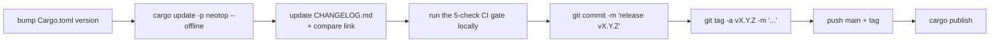

# Release process

Cutting a new tag + publishing to crates.io.

## When to bump

Semantic-versioning aligned:

| Change kind | Bump |
|-------------|------|
| Bug fix, no API / UX break | patch (`v0.27.1` → `v0.27.2`) |
| New feature, backwards-compatible UX | minor (`v0.27.2` → `v0.28.0`) |
| Breaking change to CLI flags, config schema, on-disk format | major — but we're still 0.x, so effectively minor |

## Checklist



Concretely:

1. **`Cargo.toml`**: bump `version = "X.Y.Z"`.
2. **`Cargo.lock`**: refresh with `cargo update -p neotop --offline`.
3. **`CHANGELOG.md`**:
   - Insert a new `## [X.Y.Z] — <headline>` section under `## [Unreleased]`.
   - Describe what changed and *why*, grouped by **Added / Changed /
     Fixed / Removed** as appropriate.
   - Update the compare links at the bottom:
     ```
     [Unreleased]: .../compare/vX.Y.Z...HEAD
     [X.Y.Z]: .../compare/vOLD...vX.Y.Z
     ```
4. **Run the [[contributing#The CI gate (five checks)|CI gate]] locally**.
5. **Commit**: `git commit -m "release vX.Y.Z"`.
6. **Tag**: `git tag -a vX.Y.Z -m "vX.Y.Z — <headline>"`.
7. **Push**: `git push --follow-tags origin main`.
8. **Publish**: `cargo publish`.

## What the release commit should contain

Only these three files — nothing else:

- `Cargo.toml`
- `Cargo.lock`
- `CHANGELOG.md`

Any other change belongs in a separate commit under a different branch /
PR. Keeping release commits tiny makes `git bisect` across versions
painless.

## CHANGELOG tone

- Lead with the *why*, then the *what*.
- Link to the code path or file when it aids understanding (e.g. `src/host.rs`).
- Don't mention internal tooling / AI assistance. See the global
  attribution rule.
- Short release (bug fix): ~5–10 bullets.
- Minor release (feature): summary paragraph + grouped bullets.

## Cargo publish reminders

- `cargo publish --dry-run` before the real thing if the package layout
  changed.
- `include = [ ... ]` in `Cargo.toml` controls the tarball contents.
  Currently limited to `src/**/*.rs`, `Cargo.toml`, `Cargo.lock`,
  `LICENSE`, `README.md`, `CHANGELOG.md`. Nothing else ships.
- Once published a version is immutable — no do-overs. If a bug slips
  out, `yank` the bad version and publish a patch.

## See also

- [[contributing]] — branching, CI, commit style
- [`../CHANGELOG.md`](../CHANGELOG.md) — the live file
