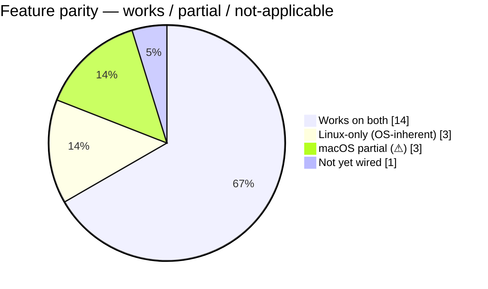

# Project status

Live parity matrix between the Linux and macOS ports. Primary README
carries a short version; this note keeps the details.

## Platform summary

## Details

| Area | Linux | macOS | Backing source |
|------|-------|-------|----------------|
| Per-core CPU + history | ✅ | ✅ | `/proc/stat` · `host_processor_info` |
| Aggregate CPU | ✅ | ✅ | same |
| CPU topology (SMT / NUMA) | ✅ | ✅ (UMA) | sysfs / `hw.{logical,physical}cpu` |
| Memory bar (used / buf / cached / free) | ✅ | ✅ (v0.27.2 fix) | `/proc/meminfo` · `HOST_VM_INFO64` |
| Swap | ✅ | ✅ | `/proc/meminfo` · `vm.swapusage` |
| Load average | ✅ | ✅ | `/proc/loadavg` · `vm.loadavg` |
| Process list + full cmdline | ✅ | ✅ (v0.27.1 fix) | `/proc/<pid>/cmdline` · `KERN_PROCARGS2` |
| Per-process disk I/O | ✅ | ⚠ | `/proc/<pid>/io` · *taskinfo SPI needed* |
| Per-disk I/O rates | ✅ | ✅ | `/proc/diskstats` · IOKit `IOMedia` |
| Per-iface network rates | ✅ | ✅ | `/proc/net/dev` · `NET_RT_IFLIST2` |
| Temperatures | ✅ | ⚠ stub | `/sys/class/hwmon` · *full SMC pending* |
| Battery | ✅ | ⚠ not wired | `/sys/class/power_supply` · *IOPowerSources pending* |
| GPU NVIDIA | ✅ | ✅ | NVML dlopen |
| GPU AMD | ✅ | ✅ | `amdgpu` sysfs · `AMDRadeon*` IOKit |
| GPU Intel discrete | ✅ | ✅ | `i915_pmu` · `IntelAccelerator*` IOKit |
| GPU Apple Silicon busy% | — | ⚠ unreliable | needs private IOReport SPI |
| KVM exits / vCPU pinning | ✅ | — | debugfs (Linux subsystem) |
| VFIO / vhost / tap | ✅ | — | sysfs |
| Group — Container | ✅ | ⚠ host-only | cgroup · proc-tree heuristic |
| Group — VM | ✅ | ✅ | argv parse |
| Group — Runtime | ✅ | ✅ (v0.27.2 fix) | argv + ELF / Mach-O |
| Group — App bundle | — | ✅ (v0.28) | outermost `.app/` in exe path |
| Group — System | ✅ | ✅ | argv basename match |
| Group — Native(basename) | ✅ (v0.28) | ✅ (v0.28) | argv[0] basename |

## Known limitations

### macOS container telemetry
Docker Desktop / Podman Machine / Rancher Desktop / OrbStack all run
containers inside a Linux VM. Only host-side Docker Desktop components
are visible to `proc_listallpids`. The current `container_macos`
detector labels those with synthesised short IDs (first 12 chars of the
process name) — not real Docker IDs. For per-container stats we'd need
to integrate with the Docker Desktop Unix socket
(`~/.docker/run/docker.sock` → `GET /containers/json` + stream
`/containers/{id}/stats`). Tracked in [[roadmap]].

### Apple Silicon GPU busy %
`IOAccelerator`'s `PerformanceStatistics` dictionary on M-series macs
often lacks `Device Utilization %`. Modern tools (`powermetrics`,
`macmon`, `asitop`) read it via the private IOReport SPI. We don't yet.

### macOS temperature
The current `temp_macos.rs` is a stub. Full SMC protocol on Intel
(`AppleSMC` user-client with `SMC_CMD_READ_KEYINFO` / `SMC_CMD_READ_BYTES`)
and IOReport channel subscription on Apple Silicon are both non-trivial
and tracked separately.

## See also

- [[platforms-linux]] — every Linux surface we read
- [[platforms-macos]] — every macOS surface we read
- [[roadmap]] — what's next
- [`../CHANGELOG.md`](../CHANGELOG.md) — shipped history
